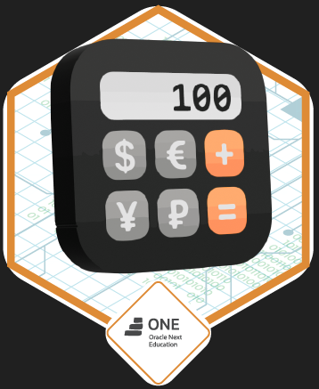

# 💱 Challenge - Conversor de Monedas 👩‍💻

**Proyecto desarrollado por:** Fernanda Flores  



---

## 📖 Descripción del Proyecto

Este proyecto es un **Conversor de Monedas en Java**, desarrollado como parte del curso *“Practicando con Java: Challenge Conversor de Monedas”*.

El objetivo es crear una **aplicación de consola** capaz de convertir divisas en tiempo real, utilizando la **API pública de ExchangeRate-API** y la biblioteca **Gson** para procesar datos en formato JSON.  

El programa permite al usuario seleccionar entre diferentes tipos de conversión, ingresar una cantidad y obtener el valor equivalente según la tasa de cambio actual.

---

## 💵 Funcionalidades del Conversor

El conversor permite las siguientes operaciones:

1️⃣ Dólar (USD) → Peso Mexicano (MXN)  
2️⃣ Peso Mexicano (MXN) → Dólar (USD)  
3️⃣ Dólar (USD) → Peso Argentino (ARS)  
4️⃣ Peso Argentino (ARS) → Dólar (USD)  
5️⃣ Dólar (USD) → Peso Colombiano (COP)  
6️⃣ Peso Colombiano (COP) → Dólar (USD)  

**Además:**
- Muestra un historial de conversiones realizadas.  
- Pausa después de cada conversión.  
- Finaliza automáticamente tras completar una operación.  
- Valida entradas numéricas y evita errores comunes del usuario.  

---

## 🧩 Pasos para construir el proyecto

### 💻 1. Configuración del entorno Java
Asegúrate de tener instalado **Java 17 o superior** y **Visual Studio Code** con la extensión *“Java Extension Pack”*.

### 🌱 2. Creación del proyecto
Crea una carpeta llamada `conversor-de-moneda` y dentro de ella el paquete `fernanda`, donde estará la clase principal `Main.java`.

### 🌐 3. Consumo de la API
El programa utiliza la API pública de [**ExchangeRate-API**](https://www.exchangerate-api.com/) con la siguiente URL base:

https://v6.exchangerate-api.com/v6/TU_API_KEY/latest/USD


*(Reemplaza `TU_API_KEY` por tu clave personal.)*

### 🧠 4. Procesamiento de JSON con Gson
La biblioteca **Gson** convierte la respuesta JSON de la API en objetos Java (mapas con tasas de conversión).

### 🧮 5. Lógica de Conversión
El programa implementa métodos para:
- Convertir desde **USD a otra moneda**.  
- Convertir desde **otra moneda a USD**.  
- Mostrar resultados **formateados con dos decimales**.

---

## 🚀 Tecnologías utilizadas

| Tecnología | Uso principal |
|-------------|----------------|
| **Java 21** | Lenguaje de programación principal |
| **Gson** | Procesamiento de datos JSON |
| **ExchangeRate-API** | Fuente de tasas de cambio en tiempo real |
| **HttpClient (Java)** | Realizar solicitudes HTTP |
| **Visual Studio Code** | IDE utilizado para escribir y ejecutar el proyecto |
| **Git y GitHub** | Control de versiones y publicación del código |

---

## ⚙️ Ejecución del Proyecto

1️⃣ Clona o descarga el repositorio:
```bash
git clone https://github.com/FernandaFloresValdes/challenge-conversor-de-moneda-1.git

2️⃣ Abre el proyecto en Visual Studio Code.

3️⃣ Asegúrate de tener Gson agregado al classpath.
Si no lo tienes, descárgalo desde:
👉 https://github.com/google/gson

y agrégalo con clic derecho → Add as Library.

4️⃣ Ejecuta la clase principal Main.java.

5️⃣ Sigue las instrucciones en pantalla, elige una conversión e ingresa la cantidad.

📚 Recursos útiles

API de tasas de cambio (ExchangeRate-API)

Librería Gson

Documentación Java HttpClient

Creado por : Fernanda Flores

Bienvenido al Conversor de Monedas
1 - Dólar => Peso Mexicano
2 - Peso Mexicano => Dólar
3 - Dólar => Peso Argentino
4 - Peso Argentino => Dólar
5 - Dólar => Peso Colombiano
6 - Peso Colombiano => Dólar
7 - Salir

Elija una opción: 1
Ingrese la cantidad: 10
10.00 USD equivale a 183.02 MXN

## 📸 Vista previa del conversor


---
